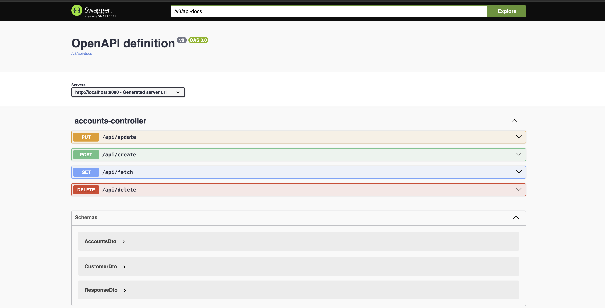
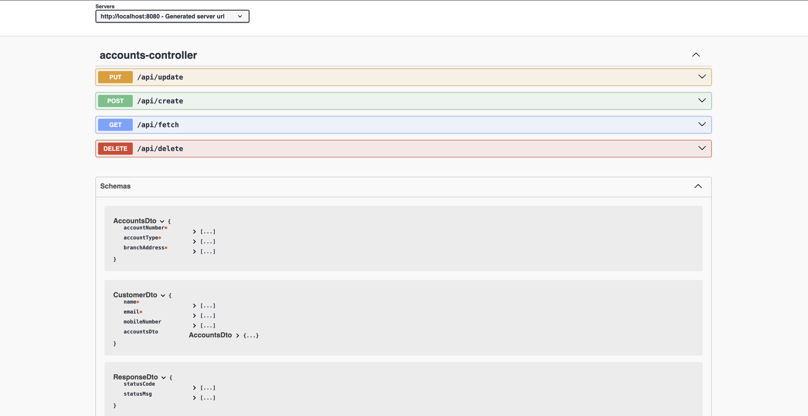
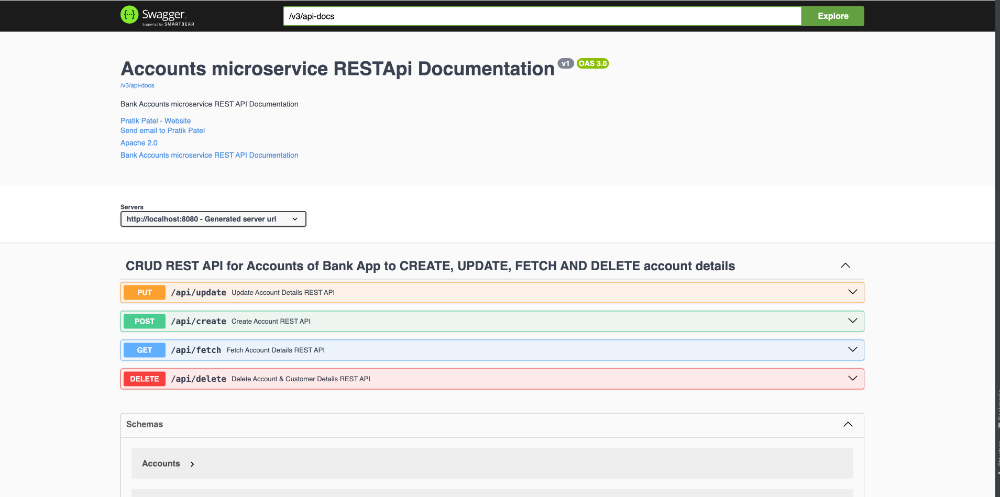
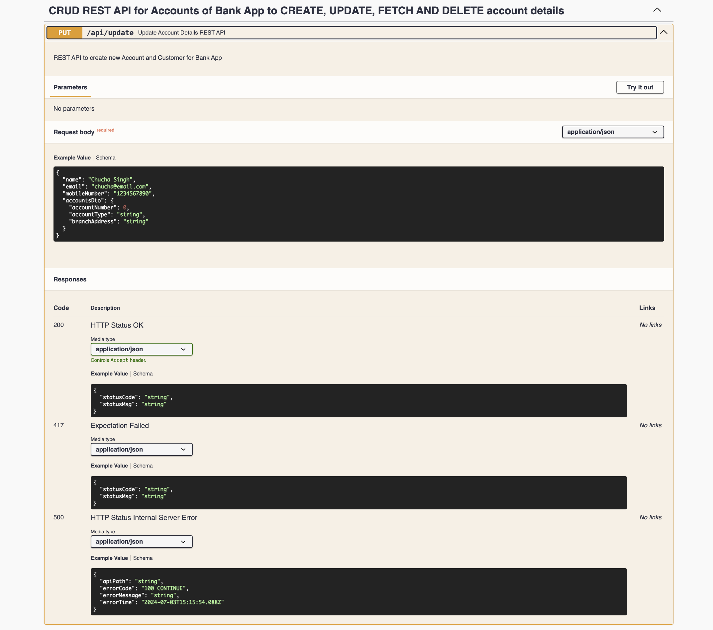
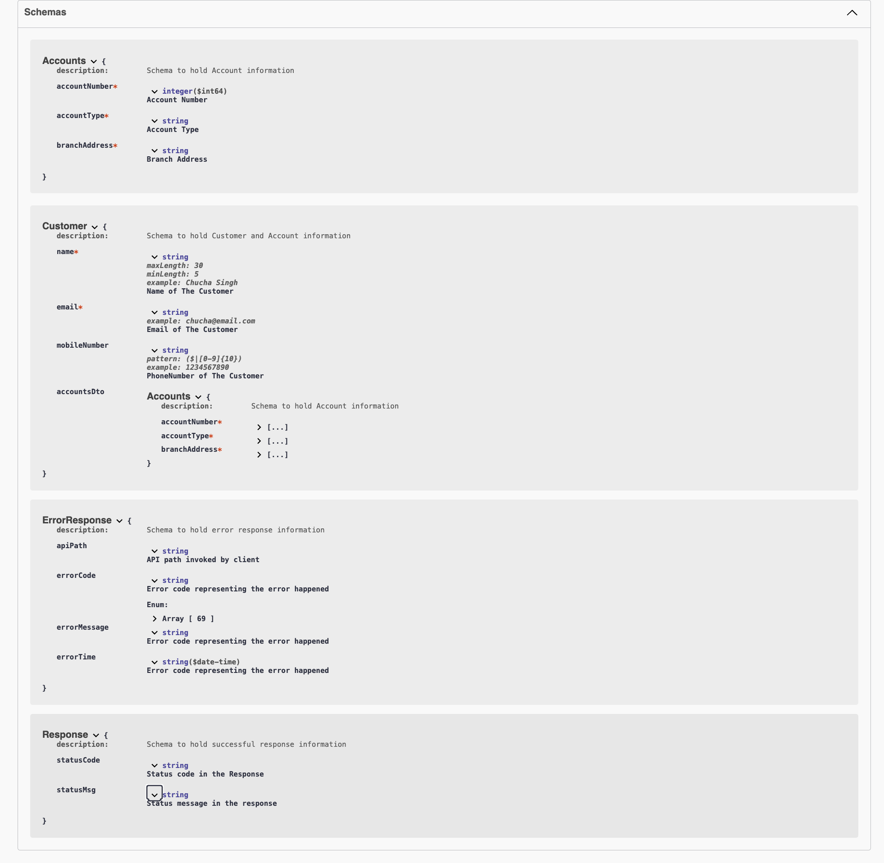

# Microservices_SpringBoot

# This file exhibits snapshots of the project details and Spring boot in-built dependencies are used

# Flow of each microservice 
'''
+------------------------------------------------------+
|                      Controller                      |
|       (Handles HTTP requests and responses)          |
+------------------------------------------------------+
|
v
+------------------------------------------------------+
|                      Service                         |
|        (Business logic and interaction with          |
|           repositories)                              |
+------------------------------------------------------+
|
v
+------------------------------------------------------+
|                Service Implementations               |
|         (Implementations of service interfaces)      |
+------------------------------------------------------+
|
v
+------------------------------------------------------+
|                     Repository                       |
|       (Direct interaction with the database)         |
+------------------------------------------------------+
|
v
+------------------------------------------------------+
|                       Entity                         |
|          (Database table representation)             |
+------------------------------------------------------+
|
v
+------------------------------------------------------+
|                       DTO                            |
|    (Data Transfer Objects for transferring data)     |
+------------------------------------------------------+
|
v
+------------------------------------------------------+
|                      Mapper                          |
|      (Convert entities to DTOs and vice versa)       |
+------------------------------------------------------+
|
v
+------------------------------------------------------+
|                      Audit                           |
|        (Track changes to entities using              |
|           JPA EntityListeners)                       |
+------------------------------------------------------+
|
v
+------------------------------------------------------+
|                    Exception                         |
|          (Custom exception handling)                 |
+------------------------------------------------------+
|
v
+------------------------------------------------------+
|                    Constants                         |
|          (Constant values used in application)       |
+------------------------------------------------------+

'''

* Banking App using Microservices using Java Spring Boot

* Needs to know some important topics
      - @ControllerAdvice -
        - Purpose: The @ControllerAdvice annotation is a specialization of the @Component annotation. It is used to define global exception handlers, model attributes, 
                    and request/response body advice that will be applied across multiple controllers.
        - Usage: It is used to handle exceptions, bind data to the model, or customize request/response handling for all controllers.
    - @Validated - 
        -   Purpose: The @Validated annotation is used to mark a class for Spring's method-level validation feature. It triggers validation on method parameters, typically used in service layer methods.
        -   Usage: It is often used in the service layer to validate method parameters before executing the method logic.
    - @Valid - 
        - Purpose: The @Valid annotation is used to trigger validation on an object. It can be used on method parameters and fields to ensure the data adheres to the specified constraints.
        - Usage: It is commonly used in controller methods and entity fields to validate data.
    
    - @EntityListeners -
      - Purpose: The @EntityListeners annotation is used in JPA (Java Persistence API) to specify callback listener classes that will receive lifecycle events for the entity. 
                    These events can include pre-persist, post-persist, pre-update, post-update, pre-remove, post-remove, and post-load.
      - Usage: It is used on entity classes to specify listener classes that handle entity lifecycle events.
  
# Swagger UI - Accounts RESTAPI
*  URL for Account RESTapi => http://localhost:8080/swagger-ui/index.html
*  URL for Loans RESTAPI => http://localhost:8090/swagger-ui/index.html
*  URL from Cards REST API => http://localhost:9000/swagger-ui/index.html

*  Well documented Swagger UI from Springboot application using OPEN API dependency

