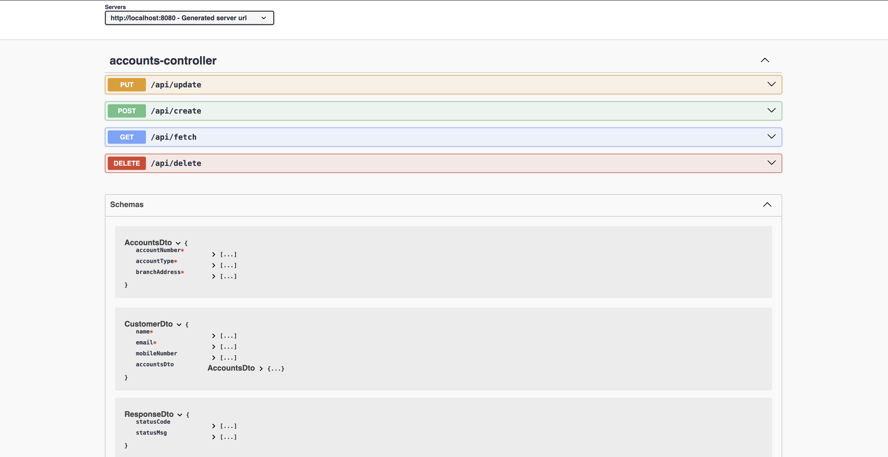

# Microservices_SpringBoot

* Banking App using Microservices using Java Spring Boot

* Needs to know some important topics 
    - @ControllerAdvice - annotation: 
            this annotation used for Custom Exception class like globalExceptionHandler, is important to intercept the errors fora ny controller class 

  
# Swagger UI - Accounts RESTAPI
*  URL for RESTapi => http://localhost:8080/swagger-ui/index.html

    